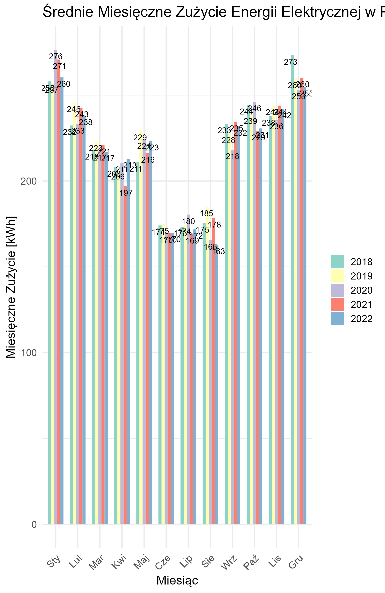

# Introduction and Project Goal

This project explores how energy storage capacity in photovoltaic (PV) systems impacts the cost of purchasing additional energy from the grid. By storing excess energy produced during peak sunlight hours, households and businesses can reduce their reliance on external energy sources. The goal is to determine the optimal storage capacity that minimizes grid energy costs, offering a cost-effective and sustainable solution for PV system users.

# Data Collection and Processing of Photovoltaic Energy Production

Data on photovoltaic energy production was sourced from the PVGIS system, configured for optimal parameters at a specific location (Odrzykoń: 49.741°N, 21.732°E). The dataset includes hourly production values adjusted for optimal panel tilt and orientation. For analysis consistency, missing data for 2021-2022 was generated based on averages from previous years. The data processing involved formatting timestamps, converting power units, and preparing the dataset for trend and seasonal analysis.

# Data Collection and Processing of Market Electricity Prices

Market electricity price data was obtained from the Polish Power Grid (PSE) in CSV format, with hourly pricing information. The data processing steps included converting timestamps to a consistent format, cleaning text and spaces, and standardizing prices from PLN/MWh to PLN/kWh for practical comparison. This cleaned and formatted dataset enabled accurate analysis of price trends and seasonal fluctuations.

Energy price trend with loss curve

# Analysis of Average Daily Energy Consumption

This analysis models the average daily energy consumption for a typical four-person household, taking into account hourly and seasonal variations. A simulation approach was used to estimate energy use patterns, with higher consumption during winter months due to heating needs and lower consumption in summer. Visualizations illustrate the daily and hourly energy usage trends, providing insights into peak demand times and seasonal changes in consumption.

# Analysis of PV Installation Without Storage

In this analysis, the photovoltaic (PV) system operates without an energy storage unit, meaning excess energy generated during peak hours cannot be stored and is instead wasted. As a result, any shortfall in energy supply must be covered by purchasing electricity from the grid. The study examines the monthly and annual costs associated with this setup, highlighting the limitations of a PV system without storage in reducing dependency on external energy sources.

# Optimization of PV System with Energy Storage

This section focuses on optimizing the photovoltaic (PV) system by integrating an energy storage unit to retain excess energy generated during peak production. By storing this surplus, energy can be used during low-production periods, reducing the need to purchase electricity from the grid. The analysis evaluates different storage capacities to identify the optimal size that maximizes cost savings and system efficiency for sustainable energy management.

# Summary and Conclusions

Integrating energy storage with a photovoltaic (PV) system significantly enhances energy efficiency by reducing reliance on grid power. The analysis shows that storage capacity plays a crucial role in minimizing additional energy costs, though an optimal balance must be struck to avoid oversizing. Ultimately, a well-optimized PV system with appropriately sized storage offers substantial cost savings, making it a viable solution for sustainable and cost-effective energy management.
